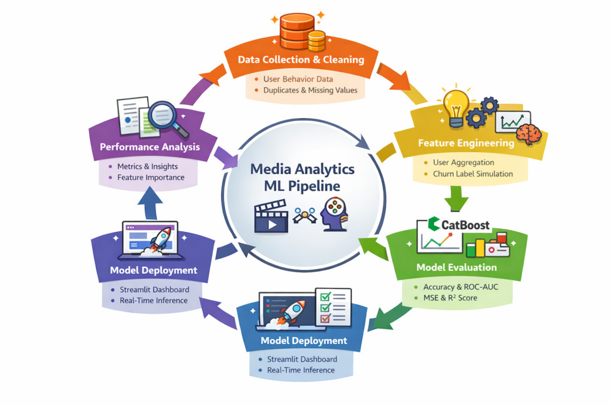

# 🎬 Media Analytics ML Dashboard

An end-to-end Machine Learning project for Customer Churn Prediction and Ad Exposure Optimization for Media Analytics of a renowned Company.

  

---

## 📌 Overview

This project analyzes media platform user behavior to:

1️⃣ Predict Customer Churn  
2️⃣ Predict Ad Exposure Count  

It includes data preprocessing, model training, evaluation, and deployment.

---

## 🎯 Models

### 🔹 Churn Prediction
- User-level behavioral aggregation
- CatBoost Classifier
- Accuracy: **0.65**
- ROC-AUC: ~0.69
- Includes confusion matrix & ROC curve

### 🔹 Ad Exposure Prediction
- Session-level behavioral features
- CatBoost Regressor
- Evaluated using MSE and R²

---

## 🏗️ Project Structure
Media Analytics/
├── Media_analytics_synthetic_50k.csv
├── train_models.py
├── evaluate_models.py
├── churn_model.cbm
├── ad_model.cbm
├── app.py
└── README.md
---

## 📊 Key Insights

- Subscription type strongly influences ad exposure.
- Watch time, buffering, and ad skipping impact churn risk.
- 65% churn accuracy reflects realistic behavioral prediction.
- Risk segmentation enables targeted retention strategies.

---

## 🛠️ Tech Stack

Python • Pandas • NumPy • Scikit-learn • CatBoost • Streamlit • Matplotlib

---
## 💼 Business Impact

- Identifies high-risk users for targeted retention campaigns.
- Enables subscription upgrade targeting.
- Helps optimize ad frequency without harming engagement.
- Supports data-driven monetization strategy.

---
## 👨‍💻 Author

Vaishnavi Choudhari  
Media Analytics & Machine Learning Project
